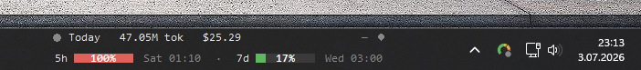
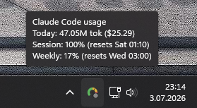
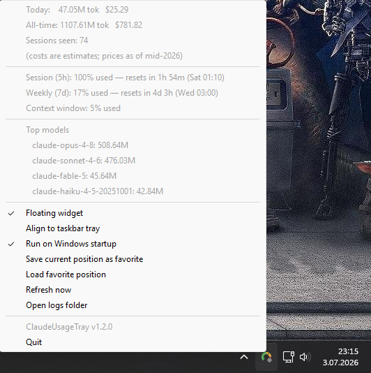

# Claudebar

<div align="center">

[](https://github.com/Celtas6655/Claudebar/actions/workflows/ci.yml)
[](https://github.com/Celtas6655/Claudebar/releases/latest)
[](LICENSE)

</div>

A small **Windows** system tray app + floating widget that shows live token
usage, estimated cost, your session/weekly rate-limit status, and a
Red/Amber/Green indicator of what Claude Code is doing right now for
[Claude Code](https://claude.ai/code) — read straight from Claude Code's own
local data.

Everything lives in one file: `claudebar.py`.

- **No API key needed** — it reads Claude Code's local session logs, not the API
- **No network access of its own** — nothing is uploaded anywhere
- **Privacy-preserving** — conversation content is never read, only model names,
  token counts, and rate-limit percentages
- **Real-time** — token totals update the instant Claude Code writes a turn (a
  filesystem watcher reacts directly, no polling delay)
- **At-a-glance status** — a Red/Amber/Green dot shows whether Claude is
  **working** (amber), **waiting on you** (red), or **done** (green)

<p align="center">
  
</p>

The floating widget is a borderless, always-on-top panel — just two compact rows
(no title bar, no close button): the working-state dot and **Today**'s tokens and
cost, then the **5h** and **7d** bars side by side. The percentage is drawn
*inside* each colored bar, with its reset time next to it. The tray icon shows
the same numbers on hover/right-click:

<p align="center">
  
</p>

## Install

### Recommended: download the standalone `.exe` (no Python needed)

1. Grab **`Claudebar.exe`** from the
   [latest release](https://github.com/Celtas6655/Claudebar/releases/latest).
   Each release also ships a `SHA256SUMS.txt` you can verify the download
   against (`Get-FileHash Claudebar.exe` in PowerShell) — the exe isn't
   code-signed, so expect a SmartScreen prompt on first run.
2. Double-click it. That's it — a tray icon and floating widget appear, and the
   app **wires up the statusLine hook for you automatically** (it adds the entry
   to `~/.claude/settings.json` only if you don't already have a `statusLine`,
   or upgrades an entry a previous version of this app wrote).
3. **Restart Claude Code once** so it starts sending session/weekly % data.

One self-contained file handles everything — the tray app, the statusLine hook,
and the auto-install. Nothing to install, no Python required. Put it wherever you
like (and see [Run it automatically when Windows starts](#run-it-automatically-when-windows-starts)
to launch it at login).

> On startup the exe also extracts a small helper, `ClaudebarHook.exe`,
> to `~/.claude/bin/` and registers *that* as the hook command. It's the same
> program minus the GUI packages, so the hooks Claude Code spawns on every turn
> start in well under half the time of the full exe. If the helper can't be
> extracted for any reason, the app quietly registers itself instead —
> everything still works, just a bit slower per turn.

### Alternative: run from source (needs Python)

- **Windows** (the tray icon, floating-widget placement, and startup toggle are
  Windows-specific; `--test` and the statusLine hook run anywhere)
- **Python 3.10+** — https://www.python.org/downloads/
- Dependencies: `pystray`, `Pillow`, `watchdog`, and `tkinter` (the last ships
  with the standard python.org installer). `pywin32` is **not** required —
  first-run taskbar placement uses `ctypes` from the standard library.

```bash
git clone https://github.com/Celtas6655/Claudebar.git
cd Claudebar
pip install -r requirements.txt
python claudebar.py
```

A small icon appears in the system tray (bottom-right, possibly tucked inside
the "hidden icons" overflow arrow). Hover it for a quick tooltip, right-click for
the full breakdown. A floating widget with the same live numbers also appears.

> On the Python installer's first screen, check **"Add python.exe to PATH"**. If
> `python` isn't found, close and reopen your terminal — a terminal opened before
> Python was installed won't see the updated PATH.

## Token totals vs. session/weekly limits — two different data sources

This is the one thing worth understanding. The app surfaces two categories of
data that come from completely different places:

**Tokens, cost, top models** come from Claude Code's local session logs
(`~/.claude/projects/**/*.jsonl`), which the app reads directly. **No setup
needed** beyond running the app.

**Session (5-hour) % and weekly (7-day) %** — the same numbers shown by Claude
Code's `/usage` command — are *not* stored locally anywhere. They only exist
inside Claude Code's live connection to Anthropic's servers. The only way to get
them is to have Claude Code hand them to you, via its `statusLine` hook.

### Setting up the statusLine hook (for session/weekly %)

**Automatic — nothing to do.** Just running the app (the `.exe` or the script)
wires the hook up for you: on every launch it adds the `statusLine` entry to
`~/.claude/settings.json` **if, and only if, you don't already have one**. It
never overwrites a `statusLine` you set yourself. After the first time, just
**restart Claude Code** so it picks up the change. (Deleted the entry and want it
back? Just launch the app again.)

**Force a rewrite** — if you want the app to overwrite an existing/foreign
`statusLine` with its own hook:

```bash
Claudebar.exe --install-hook       # or: python claudebar.py --install-hook
```

Either way the write is atomic and refuses to touch the file if it can't be
parsed cleanly, so it won't corrupt an existing config. Then **restart Claude
Code**.

**Manual way** — open (or create) `~/.claude/settings.json` (on Windows:
`%USERPROFILE%\.claude\settings.json`) and merge in one of:

```json
{
  "statusLine": {
    "type": "command",
    "command": "C:/full/path/to/Claudebar.exe --statusline-hook"
  }
}
```

…or, if running from source, `"python C:/full/path/to/claudebar.py
--statusline-hook"`. Use forward slashes (Windows accepts them here, and it
avoids JSON backslash-escaping headaches). Restart Claude Code.

Either way: on your next turn, Claude Code starts piping its session data to the
script, which caches the rate-limit numbers and prints a compact status line
(e.g. `Claude Sonnet 4.6 | ctx 22% | 5h 34% | 7d 12%`) at the bottom of your
terminal. The tray app and widget pick up that cache automatically — no restart
of the app needed.

> **The bundled `.exe` runs the hook fine** — the single windowed executable
> handles the tray app *and* the statusLine hook. (Internally the hook reads and
> writes the raw stdin/stdout file descriptors, so it works even though a
> windowed build has no console. Nothing you need to configure.)

> **The `rate_limits` field is fairly recent** in Claude Code's statusLine
> payload (Claude Code ≥ v1.2.80-ish). If after setup the tray still says
> "Session/weekly %: not available yet", update Claude Code — older versions
> don't send that field at all. Also note it's typically empty on the very first
> render of a new session and only populates after the first completed response,
> so send a second message before concluding anything is wrong.

## What it shows

<p align="center">
  
</p>

Right-click the tray icon (or read the floating widget) for:

- **Working state**: a Red/Amber/Green dot — amber while Claude is working, red
  when it needs your input (a permission prompt / your next message), green when
  it has just finished *(needs the event hooks — auto-installed, see below)*
- **Today** / **all-time**: total tokens and estimated USD cost
- **Session (5h)**: % of your rolling 5-hour rate limit used, and when it resets
  *(needs the statusLine hook above)*
- **Weekly (7d)**: % of your weekly rate limit used, and when it resets
  *(needs the statusLine hook above)*
- **Context window**: how full the current conversation's context window is
- **Top models**: which models are eating the most tokens
- **Sessions seen**: number of distinct Claude Code sessions counted
- **Refresh now**: force an immediate full rescan
- **Open logs folder**: jumps straight to `~/.claude/projects` in Explorer
- **Run on Windows startup**: toggle to launch the app automatically at login
  (Windows only)

Token totals update the moment Claude Code writes to a session file — a
filesystem watcher reacts directly rather than checking on a timer (measured at
~6–16 ms in development). Session/weekly % updates the moment the statusLine hook
writes a fresh cache, which happens on every Claude Code turn. A slower full
rescan every 30 seconds runs only as a safety net.

Once a rate-limit window's reset time passes, its old percentage is no longer
shown (it's definitionally out of date) — the bar reads `--` and the menu says
"awaiting next Claude Code turn" until Claude Code sends fresh numbers on your
next turn.

## Working-state indicator (Red/Amber/Green)

The widget shows a coloured dot (and the tray icon a matching corner pip) for
what Claude Code is doing **right now**:

- 🟡 **amber — working**: Claude submitted your prompt or is running a tool
- 🔴 **red — waiting for you**: Claude needs your input (a permission prompt, or
  your next message)
- 🟢 **green — done**: Claude just finished a response
- ⚫ **dim** when there's no recent signal (nothing has happened in the last few
  minutes, or the hooks aren't set up yet)

This can't be derived from the token logs — it's Claude Code's live per-turn
lifecycle, which only its **event hooks** expose. So the app registers a tiny
`--state-hook` command against a handful of events (`UserPromptSubmit`,
`PreToolUse`, `Stop`, `Notification`, `SessionEnd`) in
`~/.claude/settings.json`. **This is auto-installed on startup**, the same way
the statusLine hook is: the app only ever *adds or upgrades its own entries* and
never removes or edits any hooks you configured yourself. Restart Claude Code
once after first launch for the events to start firing.

When the indicator **turns red** — Claude just started waiting on you — the app
also shows a **Windows notification** ("Claude is waiting for your input"), so
you notice even when the widget is hidden behind another window. It fires once
per transition (staying red doesn't repeat it) and can be turned off with the
tray menu's **"Notify when Claude needs input"** toggle.

Running **several Claude Code sessions at once**? The indicator tracks each
session separately and shows the most attention-worthy state across them: red
("needs you") beats amber ("working"), which beats green ("done") — so one
terminal finishing can't hide another one that's still busy. Closing a session
removes it from the aggregate.

**To turn it off**, remove the entries whose command ends in `--state-hook` from
the `hooks` section of `~/.claude/settings.json`. Note the app re-adds them on
its next launch (just like the statusLine hook), so if you want them gone for
good, remove them while the app isn't running and don't relaunch it. Either way
the indicator is harmless — with no hooks firing it simply stays **dim**.

## Floating widget

Besides the tray icon, the app shows a small borderless, always-on-top widget
with the same live numbers — no hovering or clicking needed. It's two compact
rows (a `Today` line and the `5h`/`7d` bars side by side, as shown above) sized to
tuck into your taskbar height. The percentage bars are real drawn rectangles (not
text characters), so they can't be clipped or overflow regardless of font, with
the percentage drawn centered inside each bar.

- **Initial position**: on first run, it tries to sit just to the left of your
  real taskbar tray icons, using the Windows API (via `ctypes` — stdlib, nothing
  to install) to find the actual notification-area rectangle on screen. If that
  can't be detected, it falls back to a bottom-right corner estimate.
- **Drag it anywhere** by clicking and holding on the widget — its position is
  then remembered across restarts (the auto-placement only applies the very first
  time, before you've ever dragged it).
- **Show/hide it** from the tray's right-click menu ("Floating widget"). There's
  no close button on the widget itself — it's borderless by design so it blends
  into the taskbar.
- The percentage bars are color-coded: green under 50%, yellow 50–80%, red 80%+.
- The `Today` row leads with the Red/Amber/Green **working-state dot** and a
  short label (see the section above) — amber working, red waiting on you, green
  done, dim when idle.
- It shares the same data as the tray menu, so it needs the statusLine hook for
  the session/weekly lines and the event hooks for the working-state dot.

> The first-run taskbar placement is **best-effort and unverified on real
> hardware** — it needs a live Windows taskbar to query, which the dev
> environment doesn't have. It only affects where the widget appears the very
> first time (before you drag it), and it falls back gracefully if detection
> fails. If first-launch placement looks off, that's the part to flag. See
> `ARCHITECTURE.md` for details.

## Building the standalone .exe yourself

Releases are built automatically by GitHub Actions
([`.github/workflows/release.yml`](.github/workflows/release.yml)): every push to
`master` first bumps `VERSION`/`__version__` automatically (minor by default —
put `[major]` or `[patch]` in the merge/commit message to bump a different
part, or `[no-bump]` to skip bumping entirely), then builds the exe on a
Windows runner, runs the test suite and a hook smoke-test as gates, and
publishes a release tagged from the (now-bumped) `VERSION` file. Nobody needs
to hand-edit `VERSION` in a PR — just merge to `master` and a new minor
release is cut automatically.

To build one locally (or just run `build_exe.bat`, which does exactly this):

```bash
pip install pyinstaller
python generate_icon.py
pyinstaller ClaudebarHook.spec   # slim hook helper first…
pyinstaller Claudebar.spec       # …then the main exe, which embeds it
```

The two `.spec` files are the canonical build definitions (same ones the release
workflow runs). The hook spec builds `ClaudebarHook.exe` — the same script
with the GUI packages excluded, several times smaller so Claude Code's per-turn
hook spawns are fast — and the main spec embeds it into
`dist/Claudebar.exe`, a single self-contained file that runs the tray app,
the hooks, and the auto-install, with no Python needed. The icon is baked in at
build time (the tray icon itself is drawn by Pillow at runtime), so
`generate_icon.py` needs to have produced a real `icon.ico` on disk first.

> Testing the hook on a freshly built exe: use `cmd` redirection
> (`Claudebar.exe --statusline-hook < payload.json > out.txt`), **not** a
> PowerShell pipe — PowerShell doesn't capture a windowed exe's stdout, so a pipe
> would look like it produced nothing even though it works.

## Run it automatically when Windows starts

Right-click the tray icon and check **"Run on Windows startup"**. This adds a
per-user entry to
`HKEY_CURRENT_USER\Software\Microsoft\Windows\CurrentVersion\Run` (no admin
rights needed) that launches the app quietly at login — unchecking it removes the
entry. The menu item is grayed out on non-Windows platforms.

> The registry read/write is unit-tested against a disposable subkey but hasn't
> been confirmed end-to-end across a real logout/login yet. If the app doesn't
> appear after enabling it, check Task Manager's Startup tab or `regedit` under
> the path above for a `Claudebar` value.
>
> If you move, rename, or rebuild the `.exe` (or move the script, if running from
> source) after enabling the toggle, the registry entry still points at the old
> location and won't launch correctly until you toggle it off and back on from
> the new location. This isn't auto-repaired.

Prefer not to touch the registry? The manual alternative works too: press
`Win + R`, type `shell:startup`, press Enter, and drop a shortcut to the `.exe`
(or a `python claudebar.py` launcher) into that folder.

## About the cost estimate

There's a small price table near the top of `claudebar.py`
(`PRICES_PER_MILLION`, USD per million tokens, for input / output / cache-write /
cache-read across the Opus / Sonnet / Haiku tiers), snapshotted as of the date in
`PRICES_AS_OF` (also shown in the tray menu). These rates change over time and
aren't wired to any live source — if the numbers look off, check
https://platform.claude.com/docs/en/about-claude/pricing and update the dict.

## Running the test suite

```bash
python claudebar.py --test
```

Runs entirely against a temporary synthetic folder — it never touches your real
`~/.claude` data and needs no GUI backend (no `pystray`/`Pillow`/`tkinter`), so
it works in a bare CI container. Covers aggregation, cost calculation,
incremental re-reads, duplicate-message handling, the statusLine payload parser,
the working-state event mapping and its hook installer (idempotent, preserves
your own hooks), the usage-cache read/write round-trip, reset-time formatting,
the startup-toggle registry round-trip, and (if `watchdog` is installed) live
filesystem-watcher latency.

## Project layout & further reading

| File | What it is |
|---|---|
| `claudebar.py` | The entire app — tray, widget, tracker, statusLine hook, working-state event hook, hook auto-install, tests. Deliberately single-file. |
| `generate_icon.py` | Generates `icon.ico` for the PyInstaller build. |
| `requirements.txt` | Runtime dependencies (pinned exactly — they flow into released exes). |
| `Claudebar.spec` / `ClaudebarHook.spec` | Canonical PyInstaller build definitions (main exe + slim hook helper). |
| `build_exe.bat` | Local build convenience wrapper around the two specs. |
| `VERSION` | Single source of truth for the release version (checked against `__version__` by `--test`); the workflow tags from it. |
| `.github/workflows/release.yml` | Builds both exes on push to `master`, smoke-tests the hooks, and publishes a GitHub release with checksums. |
| `.github/workflows/ci.yml` | Lint (`ruff`) + test suite on Ubuntu and Windows for PRs and pushes. |
| `docs/screenshots/` | Real-hardware screenshots used in this README (widget, tray tooltip, tray menu). |
| `ARCHITECTURE.md` | Deep design & decision history — the three data sources, threading model, two bug postmortems, what's verified vs. not. **Read this before any architectural change.** |
| `CLAUDE.md` | Short index / guidance for AI agents working in this repo. |

## Contributing

Contributions welcome. A few conventions this project holds to:

- Run `python claudebar.py --test` before opening a PR — it must stay
  green and GUI-free.
- Keep **pure, testable logic at module level** and **GUI-only code as closures
  inside `run_app()`** — that split is what lets `--test` run without a display.
- Be direct about what's verified vs. not (some behaviors can only be confirmed
  on real Windows hardware).
- See `ARCHITECTURE.md` and `CLAUDE.md` for the non-negotiable constraints
  (atomic cache writes, no cross-thread Tkinter calls, don't size a window before
  rendering its content, etc.).

## License

Released under the [MIT License](LICENSE).
